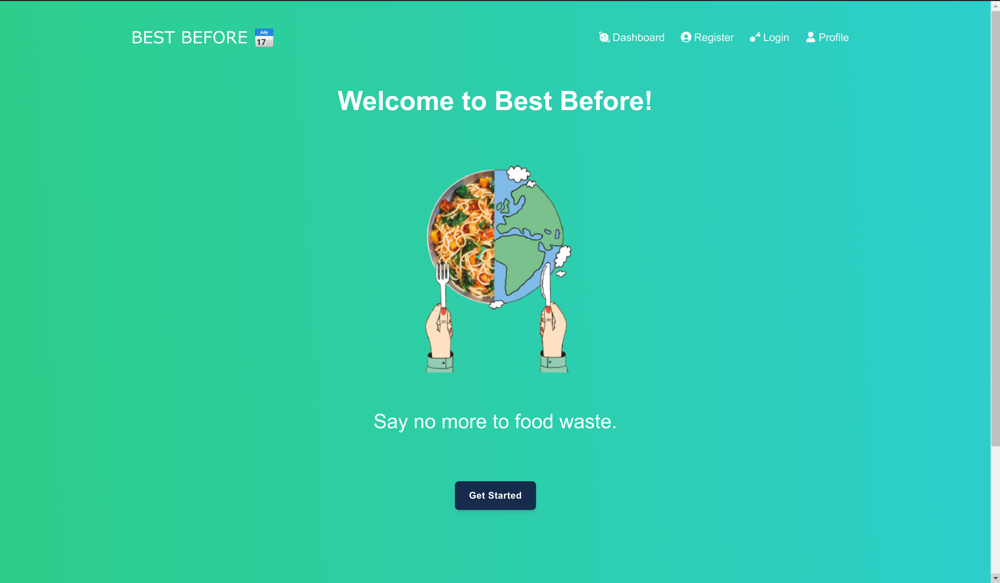
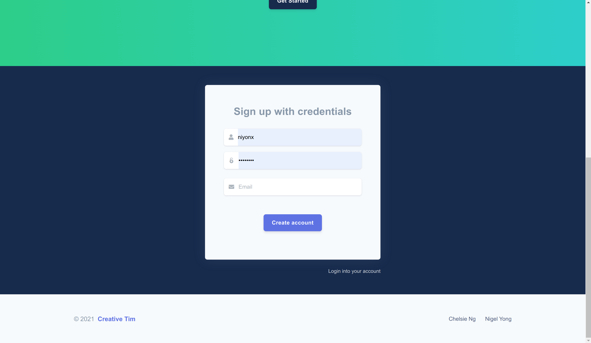
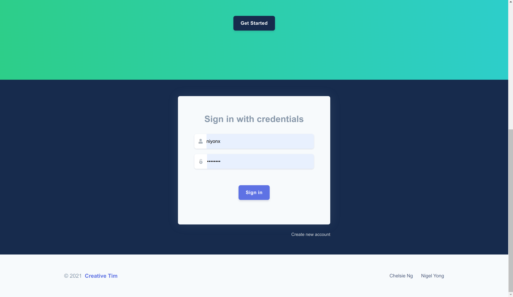
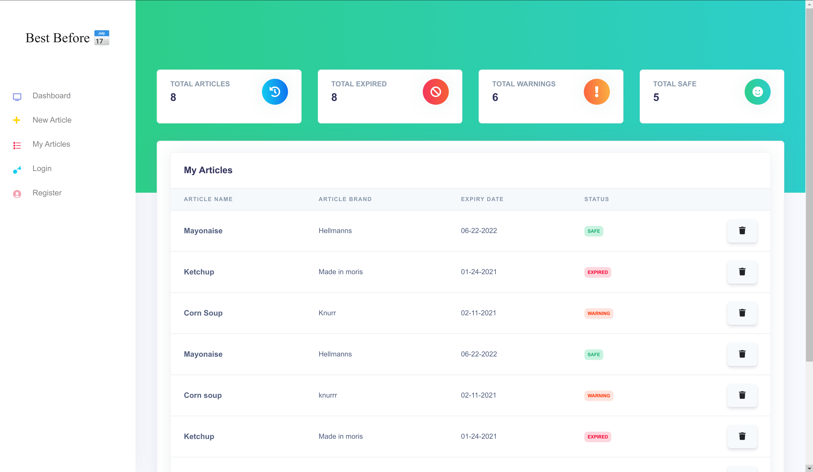
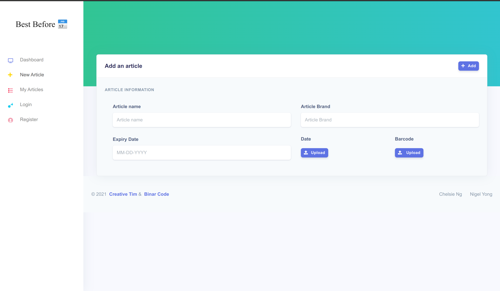
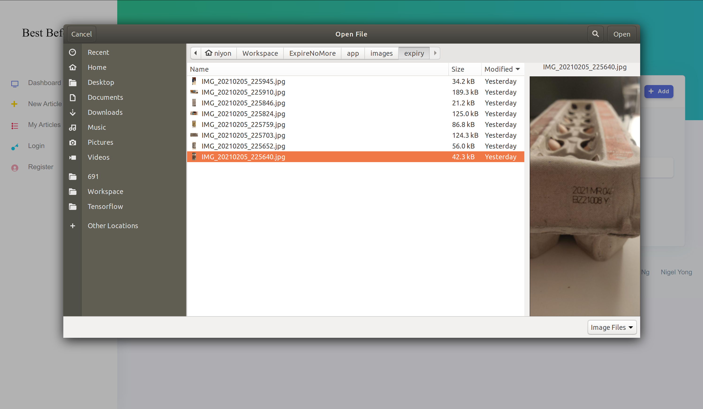
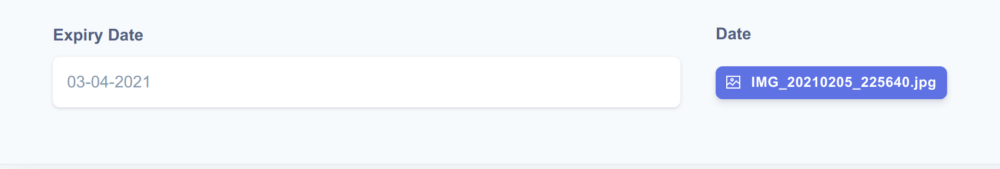
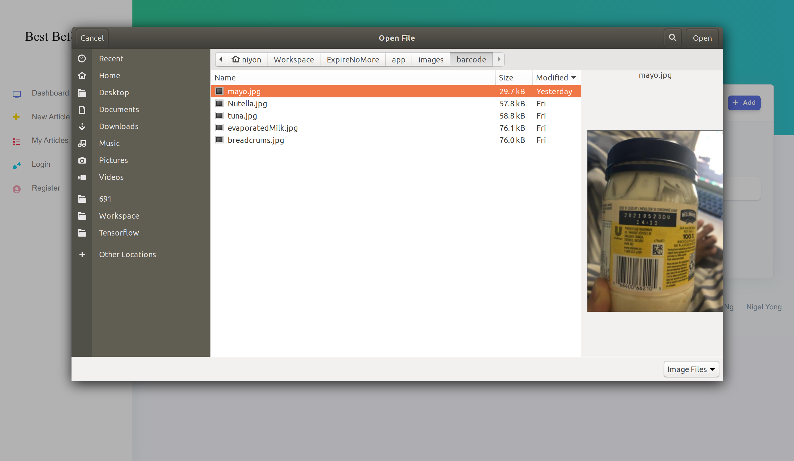
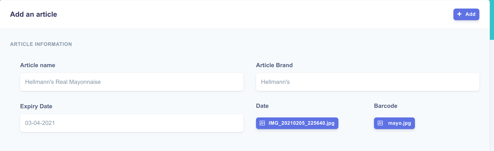
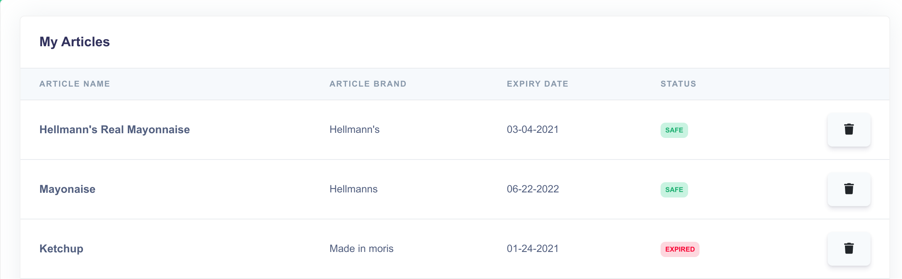

# Best Before 📅

Best Before is an expiry date tracker. It warns you when your item's lifecycle is nearly over. We make adding items super easy. Product details are auto-generated from just a barcode picture and the expiry date is recognized from just a picture. We leverage Google Cloud Vision AI, with fuzzy string matching to obtain the expiry date. Also, we use Open Source Computer Vision Library (OpenCV) and Barcode Look Up API to first read the barcode and fetch the product details! Once items are consumed, the user can easily remove tracked items. So Best Before is your companion for the whole life cycle of your grocery items!

## Hosted on
[best-before.tech](http://best-before.tech/)

## Demo 
####1. Landing page


####2. Sign up


####3. Sign in


####4. Dashboard


####5. Add articles


####6. Uploading expiry date picture


####7. Expiry date recognized


####8. Uploading barcode picture


####9. Item desprition from barcode


####10. Added item


## How to run project
### Template and Dependencies
* Clone this repository:

	```
	$ git clone https://github.com/gtalarico/flask-vuejs-template.git
	```

* Setup virtual environment, install dependencies, and activate it:

	```
	$ pipenv install --dev
	$ pipenv shell
	```

* Install JS dependencies

	```
	$ npm install
	```

### Development Server

Run Flask Api development server:

```
$ python run.py
```

From another tab in the same directory, start the webpack dev server:

```
$ npm run serve
```

